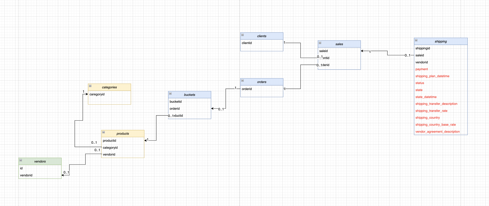

# Модификация DWH, миграция данных в новую модель.

## Задачи:
+ Мигрировать данные в отдельные логические таблицы.
+ Создать витрину данных для новой модели.

## Исходная схема таблицы



## Целевая схема


Таблица справочник стоимости доставки в страны `shipping_country_rates` из данных, указанных в `shipping_country` и `shipping_country_base_rate`.

```sql
CREATE TABLE public.shipping_country_rates
(
    id SERIAL,
    shipping_country TEXT NOT NULL,
    shipping_country_base_rate NUMERIC(14,3) NOT NULL,
    CONSTRAINT  shipping_country_rates_p_key PRIMARY KEY(id),
    CONSTRAINT check_sh_cont_base_rate
                CHECK (shipping_country_base_rate > 0
                AND shipping_country_base_rate < 1),
    CONSTRAINT shipping_country_unique UNIQUE(shipping_country);
);
```
Заполнил справочник из уникальных пар полей из таблицы `shipping`.
```sql
INSERT INTO public.shipping_country_rates(shipping_country,shipping_country_base_rate)
SELECT DISTINCT s.shipping_country, s.shipping_country_base_rate
FROM shipping s;
```

Result:

|shipping_country_id|shipping_country|shipping_country_base_rate|
|:------------------|----------------|--------------------------|
|1|usa|0.0200
|2|norway|0.0400
|3|germany|0.0100
|4|russia|0.0300

Таблица тарифов доставки вендора по договору `shipping_agreement`:

```sql
CREATE TABLE public.shipping_agreement
(
    agreementid int4 NOT NULL,
    agreement_number TEXT NOT NULL,
    agreement_rate NUMERIC(14,4) NOT NULL CHECK (agreement_rate > 0
                                            AND agreement_rate < 1),
    agreement_commission NUMERIC(14,4) NOT NULL CHECK (agreement_commission > 0
                                            AND agreement_commission < 1),
    CONSTRAINT shipping_agreement_p_key PRIMARY KEY(agreementid)
 );
```

Заполняю из уникальных комбинаций с помощью distinct, разбивая поле vendor_agreement_description на сегменты встроенной функцией regexp_split_to_array.

```sql
INSERT INTO public.shipping_agreement(agreementid, agreement_number, agreement_rate, agreement_commission)
SELECT DISTINCT
    (regexp_split_to_array(s.vendor_agreement_description, E'\\:'))[1]::INT,
    (regexp_split_to_array(s.vendor_agreement_description, E'\\:'))[2]::TEXT,
    CAST((regexp_split_to_array(s.vendor_agreement_description, E'\\:'))[3] AS NUMERIC),
    CAST((regexp_split_to_array(s.vendor_agreement_description, E'\\:'))[4] AS DOUBLE PRECISION)
FROM public.shipping s
```

Создаю таблицу `shipping_transfer`

```sql
CREATE TABLE public.shipping_transfer
(
    id serial8,
    transfer_type VARCHAR(5) NOT NULL,
    transfer_model VARCHAR(20) NOT NULL,
    shipping_transfer_rate NUMERIC(14,3) NOT NULL
                    CHECK(shipping_transfer_rate > 0 and shipping_transfer_rate < 1),
    CONSTRAINT shipping_transfer_p_key PRIMARY KEY(id)
);
```

Заполнил из уникальных комбинаций с помощью `DISTINCT`, разбивая поле `shipping_transfer_description` на сегменты встроенной функцией `regexp_split_to_array`. Поля перевожу явно к требуемым типам данных.

```sql
INSERT INTO public.shipping_transfer(transfer_type, transfer_model, shipping_transfer_rate)
SELECT DISTINCT
    (regexp_split_to_array(s.shipping_transfer_description, E'\\:'))[1]::TEXT,
    (regexp_split_to_array(s.shipping_transfer_description, E'\\:'))[2]::TEXT,
    CAST(s.shipping_transfer_rate AS DOUBLE PRECISION)
FROM public.shipping s
```

Создал таблицу `shipping_info` с уникальными доставками `shippingid` и связал её с созданными справочниками `shipping_country_rates`, `shipping_agreement`, `shipping_transfer` и константной информацией о доставке `shipping_plan_datetime`, `payment_amount`, `vendorid`.

В соответствии с новой схемой данных в новую таблицу `shipping_info` переносятся следующие поля таблицы `shipping`: `shipping_plan_datetime`, `payment_amount`, `vendorid`.

```sql
CREATE TABLE public.shipping_info
(
    shippingid int8,
    vendorid BIGINT NULL,
    payment_amount NUMERIC(14,2) NULL CHECK(payment_amount > 0),
    shipping_plan_datetime TIMESTAMP NULL,
    transfer_type_id int8 NOT NULL,
    shipping_country_id int8 NOT NULL,
    agreementid int8 NOT NULL,
    CONSTRAINT shipping_info_p_key PRIMARY KEY(shippingid),
    CONSTRAINT shipping_info_transfer_type_id_fkey FOREIGN KEY (transfer_type_id)
                    REFERENCES shipping_transfer(id),
    CONSTRAINT shipping_info_shipping_country_id_fkey FOREIGN KEY (shipping_country_id)
                    REFERENCES shipping_country_rates(id),
    CONSTRAINT shipping_agreementid_fkey FOREIGN KEY (agreementid)
                    REFERENCES shipping_agreement(agreementid)
);
```
Составил запрос из shipping с группировкой для заполнения созданной таблицы:

```sql
INSERT INTO public.shipping_info
(
    shippingid,
    vendorid,
    payment_amount,
    shipping_plan_datetime,
    transfer_type_id,
    shipping_country_id,
    agreementid
)
WITH st AS (
    SELECT id AS transfer_type_id,
            transfer_type,
            transfer_model
    FROM shipping_transfer
), scr AS (
    SELECT id AS shipping_country_id,
            shipping_country
    FROM shipping_country_rates t
)
SELECT DISTINCT
    s.shippingid,
    s.vendorid,
    s.payment_amount,
    s.shipping_plan_datetime,
	st.transfer_type_id,
    scr.shipping_country_id,
	(regexp_split_to_array(s.vendor_agreement_description, E'\\:'))[1]::INT
FROM shipping s
LEFT JOIN st ON (regexp_split_to_array(s.shipping_transfer_description, E'\\:'))[1]::TEXT = st.transfer_type
            AND (regexp_split_to_array(s.shipping_transfer_description, E'\\:'))[2]::TEXT = st.transfer_model
LEFT JOIN scr ON s.shipping_country = scr.shipping_country;
```
```sql
SELECT *
FROM public.shipping_info
LIMIT 5;
```

|shippingid	vendorid|payment_amount|shipping_plan_datetime|transfer_type_id|shipping_country_id|agreementid|
|:-----|-------|----------|------|-------|-----|
|46123	|3	|1.50	|2022-04-04 10:19:33.500	|4	|1	|5
|15790	|3	|4.42	|2022-01-17 02:48:10.653	|3	|1	|6
|2818	|3	|1.50	|2022-01-16 11:57:40.027	|4	|4	|5
|46405	|3	|14.49	|2022-03-25 16:42:14.680	|4	|3	|5
|42345	|2	|6.57	|2022-03-01 13:49:52.397	|4	|3	|11

Таблица статусов о доставке `shipping_status`.
В соответствии с новой схемой данных в новую таблицу `shipping_status` переносятся следующие поля таблицы `shipping`: `shippingid`, `status`, `state`.

```sql
CREATE TABLE public.shipping_status
(
    shippingid int8 PRIMARY KEY,
    status TEXT NOT NULL CHECK(status IN('in_progress', 'finished')),
    state TEXT NOT NULL ,
    shipping_start_fact_datetime TIMESTAMP NOT NULL CHECK(shipping_start_fact_datetime <= shipping_end_fact_datetime),
    shipping_end_fact_datetime TIMESTAMP NULL
);
```

Заполнил таблицу:

```sql
insert into public.shipping_status(shippingid, status, state, shipping_start_fact_datetime, shipping_end_fact_datetime)
WITH ts AS (
    SELECT s1.shippingid,
	        first_value(s1.status) OVER (PARTITION BY shippingid ORDER BY state_datetime DESC) last_status,
	        first_value(s1.state) OVER (PARTITION BY shippingid ORDER BY state_datetime DESC) last_state,
	        max(CASE WHEN s1.state = 'booked' THEN s1.state_datetime END) OVER (PARTITION BY shippingid) start_dt,
	        max(CASE WHEN s1.state = 'recieved' THEN s1.state_datetime END) OVER (PARTITION BY shippingid) end_dt
	FROM shipping s1
)
SELECT DISTINCT
    s.shippingid,
    ts.last_status,
    ts.last_state,
    ts.start_dt,
    ts.end_dt
FROM shipping s
LEFT JOIN ts ON s.shippingid = ts.shippingid;
```

Rsult:

|shippingid|status|state|shipping_start_fact_datetime|shipping_end_fact_datetime|
|:----|-----|-----|-----|-----|
|1873|finished|recieved|2021-10-18 18:29:55.541|2021-10-29 10:10:52.726
|929|finished|recieved|2021-11-24 06:28:42.339|2021-11-27 15:29:20.020
|17696|finished|recieved|2021-12-28 04:50:31.643|2022-01-05 00:13:23.991
|1122|finished|recieved|2021-08-18 07:27:37.784|2021-09-05 20:41:08.091
|3492|finished|recieved|2021-08-23 08:15:17.097|2021-08-25 13:27:53.011

Создал представление `shipping_datamart` на основании готовых таблиц для аналитики и включил в него: `shippingid` `vendorid` `transfer_type` — тип доставки из таблицы `shipping_transfer` `full_day_at_shipping` — количество полных дней, в течение которых длилась доставка. Высчитывается как:`shipping_end_fact_datetime-shipping_start_fact_datetime`. `is_delay` — статус, показывающий просрочена ли доставка. Высчитывается как:`shipping_end_fact_datetime`

Создал итоговую витрину `shipping_datamart` как представление из таблиц `shipping`, `shipping_status`, `shipping_agreement`:

```sql
CREATE OR REPLACE VIEW public.shipping_datamart AS
(
    select si.shippingid,
            si.vendorid,
            si.transfer_type_id,
            (DATE_PART('day', ss.shipping_end_fact_datetime - ss.shipping_start_fact_datetime))::int as full_day_at_shipping,
            coalesce((ss.shipping_end_fact_datetime > si.shipping_plan_datetime), false) as is_delay,
            (ss.status = 'finished') as is_shipping_finish,
            (case when ss.shipping_end_fact_datetime > si.shipping_plan_datetime then
            DATE_PART('day', ss.shipping_end_fact_datetime - si.shipping_plan_datetime)end)::int as delay_day_at_shipping,
            si.payment_amount,
            si.payment_amount*(cr.shipping_country_base_rate+sa.agreement_rate+st.shipping_transfer_rate) as vat,
            si.payment_amount*agreement_commission as profit
    from public.shipping_info si
    left join public.shipping_status ss on ss.shippingid = si.shippingid
    left join public.shipping_agreement sa on sa.agreementid = si.agreementid
    left join public.shipping_country_rates cr on cr.id = si.shipping_country_id
    left join public.shipping_transfer st on st.id = si.transfer_type_id
);
```

Итоговый результат:
```sql
SELECT *
FROM public.shipping_datamart
LIMIT 5;
```

|shippingid|vendorid|transfer_type_id|full_day_at_shipping|is_delay|is_shipping_finish|delay_day_at_shipping|payment_amount|vat|profit|
|:---|----|----|----|----|----|----|----|----|----|
|1|1|4|9|false|true||6.06|1.181700|0.121200
|2|1|4|4|false|true||21.93|3.837750|0.219300
|3|1|2|0|false|true||3.10|0.279000|0.031000
|4|3|4|5|false|true||8.57|0.728450|0.085700
|5|3|4|11|true|true|6|1.50|0.172500|0.015000

Процент задержек по поставщикам:
```sql
WITH t AS (
    SELECT t1.*,
            count(1) OVER (PARTITION BY vendorid) total_cnt
    FROM shipping_datamart t1
)
SELECT t.vendorid,
        t.is_delay,
        count(1) cnt,
        min(t.total_cnt) total_cnt,
        round(100*count(1)/min(t.total_cnt)::NUMERIC,2) AS perc
FROM t
WHERE t.is_delay = true
GROUP BY t.is_delay, t.vendorid
ORDER BY t.vendorid, t.is_delay
LIMIT 5;
```
|vendorid|is_delay|cnt|total_cnt|perc|
|:---|----|----|----|----|
|1|true|551|17850|3.09
|2|true|523|18055|2.90
|3|true|5637|18046|31.24
|5|true|2|35|5.71
|6|true|2|30|6.67

Процент возвратов по поставщикам:
```sql
WITH t AS (
    SELECT sd.vendorid,
            ss.state,
            count(1) OVER (PARTITION BY vendorid) vendor_cnt,
            CASE WHEN ss.state = 'returned' THEN 1 END ret_flag
    FROM public.shipping_datamart sd
    JOIN shipping_status ss ON ss.shippingid=sd.shippingid
)
select vendorid,
        state,
        count(1) state_cnt,
        vendor_cnt,
        round(100*count(1)/min(t.vendor_cnt)::NUMERIC,2) AS perc
FROM t
WHERE state = 'returned'
GROUP BY state, vendorid, vendor_cnt
ORDER BY vendorid, state
```
|vendorid|state|state_cnt|vendor_cnt|perc|
|:---|----|----|----|----|
|1|returned|267|17850|1.50
|2|returned|258|18055|1.43
|3|returned|267|18046|1.48
|7|returned|3|41|7.32
|15|returned|1|9|11.11
|21|returned|14|28|50.00